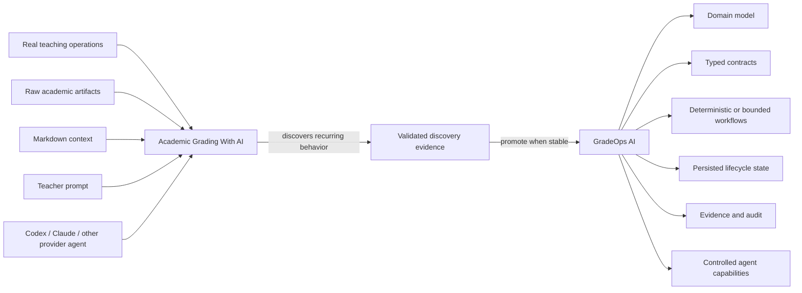

# Relationship with GradeOps AI

## Status

Active architectural, governance, and product-discovery relationship.

## Governance and ownership

Academic Grading With AI is an **active founder-personal teaching asset governed under the ADÜMÜN operating model**.

Its governance scope does not imply corporate ownership. It remains a personal/docente operational workspace used in real teaching activity while following ADÜMÜN governance, documentation, evidence, lifecycle, and architectural standards.

Machine-readable governance is defined in `docs/governance/adumun-governance-and-gradeops-relationship.yaml`.

## Decision

Academic Grading With AI is an **active agentic reference implementation / living behavioral prototype** for GradeOps AI.

It is not a legacy alias, a superseded predecessor, or a competing product.

GradeOps AI is the broader structured product and system of record. This workspace is the high-flexibility operational reference used to discover, exercise and validate assessment workflows through provider agents such as Codex or Claude.

## Why this workspace is intentionally less deterministic

The workspace operates from contextual Markdown and raw academic artifacts rather than requiring every rule to exist as application code. Typical inputs include:

- `statement.md` and `rubric.md`;
- `base.md`, `case.md`, and `plan.md`;
- PDFs and office documents;
- student submissions and extracted evidence;
- rosters, section configuration and form assignments;
- generated grading, review, publication and delivery artifacts.

The agent interprets those inputs, reasons over them, executes deterministic helper scripts where available, and orchestrates the workflow. Therefore some behavior is model-mediated and context-dependent by design.

## Discovery and convergence model

Academic Grading With AI discovers and exercises behavior in real teaching operations; GradeOps AI industrializes the behavior that becomes stable, reusable and product-worthy.

## Relationship semantics

Academic Grading With AI is simultaneously:

- a teaching-operational workspace;
- a behavioral reference implementation;
- a discovery source for GradeOps AI;
- a proving ground for agentic assessment workflows;
- a source of edge cases, heuristics, interaction patterns and evidence.

GradeOps AI may consume those discoveries, but the two assets do not merge. The reference workspace remains independently useful and operational.

## Extraction rule

When a workflow becomes frequent and stable, decide whether it should become:

1. deterministic domain/application logic in GradeOps AI;
2. a typed, bounded agent contract;
3. an explicit human-review/approval workflow;
4. structured evidence/lifecycle semantics;
5. or remain exploratory behavior in this workspace.

Stable product invariants must not remain hidden indefinitely in prompts or Markdown. Conversely, exploratory or genuinely interpretive behavior should not be forced into deterministic code prematurely.

## Long-term role

This workspace remains useful even as GradeOps AI matures. It provides a fast environment to discover edge cases, new workflows, grading heuristics and provider-agent behavior before those patterns are promoted into the structured product.

The intended relationship mirrors other ADÜMÜN-governed founder assets that feed reusable products or capabilities: governance is shared, ownership remains explicit, and validated reusable behavior flows toward the product without erasing the source asset.
