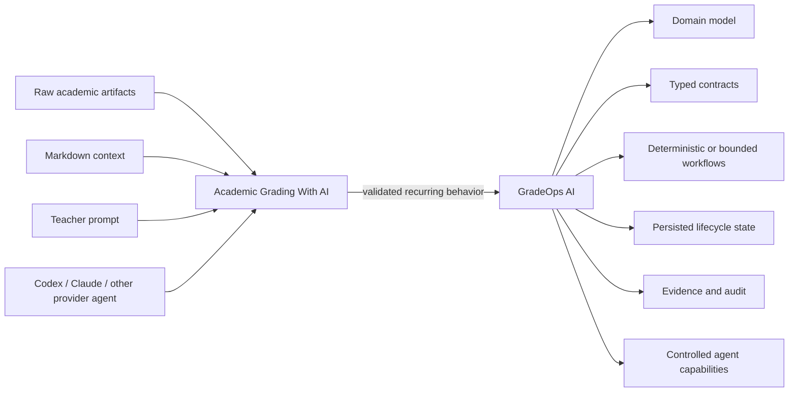

# Relationship with GradeOps AI

## Status

Active architectural relationship.

## Decision

Academic Grading With AI is an **active agentic reference implementation / living behavioral prototype** for GradeOps AI.

It is not a legacy alias, a superseded predecessor, or a competing product.

GradeOps AI is the broader structured product and system of record. This workspace is the high-flexibility operational reference used to discover, exercise and validate assessment workflows through provider agents such as Codex or Claude.

## Why this workspace is intentionally less deterministic

The workspace operates from contextual Markdown and raw academic artifacts rather than requiring every rule to exist as application code. Typical inputs include:

- `statement.md` and `rubric.md`;
- `base.md`, `case.md`, and `plan.md`;
- PDFs and office documents;
- student submissions and extracted evidence;
- rosters, section configuration and form assignments;
- generated grading, review, publication and delivery artifacts.

The agent interprets those inputs, reasons over them, executes deterministic helper scripts where available, and orchestrates the workflow. Therefore some behavior is model-mediated and context-dependent by design.

## Convergence model

Academic Grading With AI discovers and exercises behavior; GradeOps AI industrializes it.

## Extraction rule

When a workflow becomes frequent and stable, decide whether it should become:

1. deterministic domain/application logic in GradeOps AI;
2. a typed, bounded agent contract;
3. an explicit human-review/approval workflow;
4. or remain exploratory behavior in this workspace.

Stable product invariants must not remain hidden indefinitely in prompts or Markdown. Conversely, exploratory or genuinely interpretive behavior should not be forced into deterministic code prematurely.

## Long-term role

This workspace remains useful even as GradeOps AI matures. It provides a fast environment to discover edge cases, new workflows, grading heuristics and provider-agent behavior before those patterns are promoted into the structured product.
